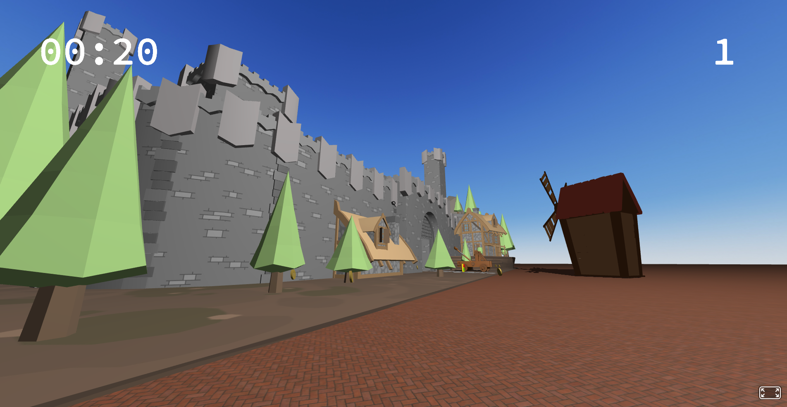

# This is a [A-frame](https://aframe.io) project.




## Getting Started

First, clone this repository:

```bash
https://github.com/felipealbuq/A-Frame-mini-game.git
```

Open the file index.html and you need the live preview server, then browser and see the result.

## Learn More

To learn more about Next.js, take a look at the following resources:

- [A-Frame Documentation](https://aframe.io/docs/1.5.0/introduction/) - learn about A-Frame features and API.

- [Learn A-frame](https://aframe.io/examples/showcase/helloworld/) - an interactive A-frame tutorial.


## Deploy on GitHub Pages

Check out my [A-Frame Mini Game](https://felipealbuq.github.io/A-Frame-mini-game/)
